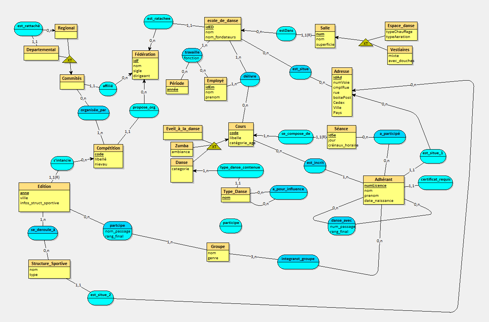

# Projet de Gestion d'Écoles de Danse

Ce projet est une application web backend pour la gestion des écoles de danse, développée en utilisant le modèle Modèle-Vue-Contrôleur (MVC) avec les langages PHP, CSS et HTML. 

# Base de Données - Conception

## Diagramme UML (Entité/Association)

Le diagramme UML ci-dessus illustre la conception de la base de données pour le projet de gestion des écoles de danse. Il représente les entités et les associations entre elles, offrant une vue claire de la structure de la base de données.

La base de données a été implémentée en utilisant PHPMyAdmin comme plateforme de gestion de base de données, garantissant une gestion efficace et sécurisée des informations relatives aux écoles de danse.

## Technologies Utilisées
- **Modèle-Vue-Contrôleur (MVC)**
- **Langages:** PHP, CSS, HTML
- **Base de Données:** PHPMyAdmin

## Fonctionnalités Principales
- Gestion des Écoles
- Gestion des Cours
- Gestion des Élèves

## Structure du Projet
- **/controllers:** Contrôleurs MVC
- **/models:** Modèles MVC
- **/views:** Vues MVC
- **/css:** Styles

## Installation
1. Clonez le dépôt: `git clone https://github.com/votre-utilisateur/ProjetEcolesDanse.git`
2. Configurez votre serveur web.
3. Importez la base de données depuis `/database` dans PHPMyAdmin.

## Configuration
1. Éditez `/config/config.php` pour les paramètres de la base de données.

## Capture

## Vidéo de Prévisualisation

Cliquez sur l'image ci-dessus pour regarder la vidéo de prévisualisation.

## Licence

Ce projet est sous licence GNU AGPLv3. Consultez le fichier [LICENSE](LICENSE) pour plus de détails.
